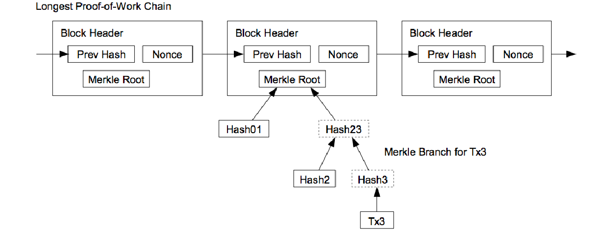
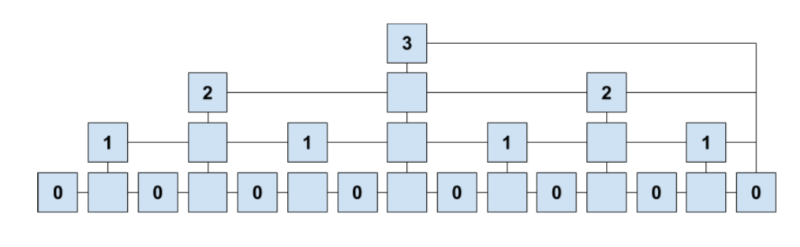

==========
区块链介绍
==========

:author: yihuang
:email: yi.codeplayer@gmail.com
:home: http://yi-programmer.com

区块链
======

.. class:: incremental

* 新一代的P2P网络应用

  =========== ==========
  Bitcoin      BT下载     
  =========== ==========
  分布式账本   文件分享 
  矿工         做种     
  币           ?        
  =========== ==========

* 能融到资的开源项目
* 也许能诞生新的互联网形态

P2P网络
=======

.. class:: incremental

* bitcoin: gossip network(out:8, in:117)

  随机网络结构

* eth/ada: kademlida DHT

  结构化网络，使用XOR操作定义节点之间虚拟距离

eclipse attack
==============

.. class:: incremental

* 使用恶意节点包围目标节点，通过过滤/伪造消息进行进一步的攻击
* 2015 Eclipse Attacks on Bitcoin’s Peer-to-Peer Network
* 2018 Low-Resource Eclipse Attacks on Ethereum’s Peer-to-Peer Network

  攻击成本：两台电脑

eclipse attack
==============

攻击方式：

    * 连接垄断
    * 占领路由表

密码学哈希函数
==============

* 把任意长度的输入转换到固定长度的输出
* 不可逆
* 不碰撞
* 实现：sha256

非对称加密
==========

* 私钥生成公钥，公钥不能反推私钥。
* 公钥加密，私钥解密
* 私钥签名，公钥验证
* 实现：RSA和椭圆曲线

数据结构
========

.. class:: incremental

* hash list

  哈希链表

* hash chain::

    H(H(H(H(...H(data)...))))

数据结构
========

* hash tree(Merkle tree)

  .. image:: ../../images/merkle_tree.png

BlockChain
==========

* 可以不存储历史Merkle Tree，降低存储需求

SPV Proof
==========

* 减少同步数据

Bloom Filter
============

* 数据哈希后添加到BitSet
* 允许低概率的false positive

Proof of Work
=============

::

    h ≤ T

* h 是区块的哈希，通过调整nouce值，调整哈希结果。
* T 是当前难度，通过调整难度，调整出块时间。
* 防DoS攻击（和验证码的区别？）

Sidechain
=========

* 在一个链上销毁资金
* 在另一个链上创建资金
* 如何在另一个链上验证交易？

Sidechain
=========

Proofs of Proof of Work

* μ-superblocks: h ≤ T/(2^μ)

记账模型(UTxO)
===============

.. code-block:: haskell

    data Transaction = Transaction{
        txid :: TxId,
        inputs :: [Input],
        outputs :: [Output],
        proofs :: [(PubKey, Signature)]}
    data Input = Input {
        txid :: TxId,
        index :: Int }
    data Output = Output {
        address :: Address,
        value :: Value }

记账模型(UTxO)
===============

.. code-block:: haskell

    type Ledger = [Transaction]

    -- global state.
    utxos :: Set Input -- Why not set of Output?

记账模型(账户余额)
===================

.. code-block:: haskell

    data Transaction = Transaction{
        from :: Address,
        to :: Address,
        value :: Value,
        fee :: Value,
        nonce :: Unique, -- 防止重放攻击
    }
    type Ledger = [Transaction]

    -- global state.
    balances :: Map Address Value

记账模型
========

* Bitcoin/ADA：UTxO

  * 可以不重用地址，隐私性
  * 可批量

* Eth：账户余额

  * 智能合约可以直接修改余额，更方便。

* 等价，可以相互转换。

共识算法
========

* 目的：需要一个节点来处理写请求（共识+随机）
* PoW：算力竞赛+最长链
* PoS：加权随机+最长链

安全属性
========

* Persistence

  有一定深度的区块不能被推翻

* Liveness

  有效的交易请求一定会进入Persistence状态

PoW
====

* 简洁
  
  安全性证明, 2015 The Bitcoin Backbone Protocol: Analysis and Applications

* 不环保
* 矿工利益和币价不必然挂钩

PoS
====

* 得到某个随机数
* 按照份额比例加权随机选取节点打包区块
* 份额越大，攻击成本越大
* 性能上有更大的扩展余地

PoS
===

难点：

* 打包区块没有成本，恶意节点很容易产生分叉
* 从区块数据本身获取随机性可能不安全

Ouroboros(PoS)
==============

* 第一个可证明安全性的PoS协议（Cardano团队）
* 使用Secure Multi-Party Computation得到随机数

Ouroboros(PoS)
==============

.. image:: images/ouroboros.png
    :width: 80%

Ouroboros(PoS)
==============

Forkable String is Rare.

.. image:: ../../images/forkable-string.png

生成随机数
==========

基础密码学工具:

* Commitment
* Coin-Tossing
* Verifiable Secret Sharing

Commitment Schema
=================

* Commit Phase

  发送 ``C = Enc(k, r, m)``, 对方收到C

* Open Phase

  发送 ``k, r, m``, 对方验证 ``Enc(k, r, m)==C``

Commitment Schema
=================

.. class:: incremental

* Hiding:  commit不能泄漏原值的信息
* Binding: 只有用原来那个值才可以打开commit
* perfectly/computational binding

  就算无限算力也无法修改commit的值

* perfectly/computational hiding

  就算无限算力也无法从commit反推原值

* 实现：加密、哈希 (他们的安全属性如何?)

Coin-Tossing
=============

.. class:: incremental

* A->B, ``COMMIT(n, s1)``
* B->A, ``s2``
* A->B, ``OPEN(n, s1)``, B得到s1
* A, B 分别计算 ``s = xor s1 s2``
* 问题: A收到s2后不发送OPEN, Abort!

Secret Sharing
==============

* ``SHARES(S) -> S1, S2, ... Sm``
* ``RECONSTRUCT(S1, S2, ... St) -> S``
* t-OUT-OF-m secret sharing

Secret Sharing
==============

Example for ``t==m``:

::

    # SHARES(S)
    Sa = xor S Ra
    Sb = xor S Rb
    Sc = xor S Rc
    Sd = xor Ra Rb Rc

    # RECONSTRUCT(Sa, Sb, Sc, Sd)
    xor Sa Sb Sc Sd = S

Verifiable Secret Sharing
==========================

* ``VERIFY(Si) -> Bool``
* 防止分发share的人作弊

完整随机数协议
==============

.. class:: incremental

* Commit阶段

  产生secret，广播commit。

  产生shares，使用对应节点公钥加密并发送。

* Open阶段

  广播open

完整随机数协议
==============

.. class:: incremental

* Recovery阶段

  没有收到open的，使用shares恢复其secret。

* 所有secrets合并，得到所有人一致认可的随机数。

综合起来
========

* 使用链代替广播
* 随机数协议和区块链协议并行执行

Ouroboros(PoS)
==============

.. image:: images/ouroboros.png
    :width: 80%

参考资料
========

* https://iohk.io/research/papers/
* https://www.youtube.com/channel/UCBJ0p9aCW-W82TwNM-z3V2w
* Wikipedia.

Q & A
=====

Thanks.
