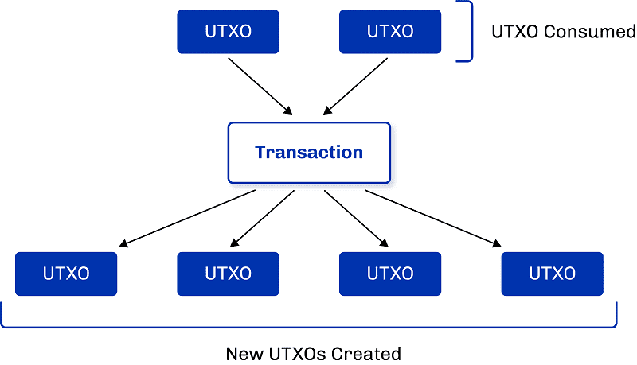

## Block Chain

- Consensus + Ledger
- Throughput = Block size / Block time

# Consensus

## Consensus

| Consensus          | Finality      | Message Complexity |
| ------------------ | ------------- | ------------------ |
| Nakamoto Consensus | Probabilistic | Low                |
| PBFT               | Instant       | High               |

## Nakamoto Consensus

|      | Scarce Resource   | Energy Consumption |
| ---- | ----------------- | ------------------ |
| PoW  | Objective         | High               |
| PoS  | Circular Argument | Low                |

## Nakamoto Consensus

- Bootstrapping?
- Sybil attack?
- Long range attack?
- Self healing?
- Time stamping?

## P2P Networking

- Efficient topology
- Eclipse attack
- Random gossiping + latency measurements.

# Ledger

## Ledger

- Deterministic state machine

| Model   | On-Chain State | Off-chain support <br />for smart contract |
| ------- | -------------- | ------------------------------------------ |
| Account | Complex        | Less                                       |
| UTxO    | Simple         | More                                       |

## Ledger

```python
def apply_block(state: State, block) -> State:
    for tx in block:
        state = apply_tx(state, tx)
    return state
```

## Account Model

```python
type State = KVStore

def apply_tx(state: State, tx) -> State:
    code = state.get_code(tx.to)
    eval(state, code, tx)
```

- Blockchain as a world computer
- Scalability of merkle trie

## UTxO Model



## UTxO Model

```python
type State = Set[TxIn]

def apply_tx(state: State, tx) -> State:
    for input in tx.inputs:
        assert input.txin in state
        assert verfy(input.txin, input.witness)
    state.remove(tx.inputs)
    state.add(tx.outputs)
```

- Local validation
- Parallelization
- Deterministic
- How to support smart contract?

## UTxO Smart Contract

```python
def verify(txin, witness):
    assert hash(witness.code) == txin.address
    assert eval(witness.code, context) == True
```

- Constraint Emitting Machines (State Machines)

## UTxO Smart Contract - Swap


# L1 Scalability

## Scalability

> Throughput = Block size / Block time

- Block time = block diffusion time + consensus overhead
- Block diffusion time 和网络质量和区块大小相关

## Pipelining

- Block diffusion | block execution


## Decompose Block (prism protocol)

Decompose three tasks:

- Transaction validation and diffusion
- Block proposal
- Block voting

## Decompose Block (prism protocol)


## Sharding

- Fix state explosion in account model

# L2/3 Scalability

## Payment Channel

- Multisig transaction
- Hash Time-lock Contract


## Payment Channel - Lightning Network


## State Channel

- *[on chain]* Open a channel
- *[off chain]* Execute transactions and checkpoints
- *[on chain]* Commit successfully or resolve dispute on-chain
- Example: Poker Game
- Fixed number of online participants

## State Channel - Hydra


## State Channel

- Cross channel communication
- Tail protocol

## Side Chain [cosmos]

- Inter-blockchain-Communication
- Inter-blockchain-Security

## Client Side Validation (RGB protocol)


## Client Side Validation (RGB protocol)

- Only use L1 as verifiable publication medium.
- Works on both bitcoin L1 and lightning network.

## Rollups

- Optimistic Rollups
- ZK Rollups

# Q & A