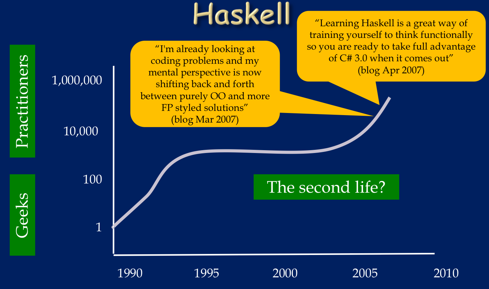

==================
编写显然正确的代码
==================

:author: yihuang
:email: yi.codeplayer@gmail.com
:blog: http://yi-programmer.com/
:github: http://github.com/yihuang

代码质量的两个方面
==================

* 抽象
* 健壮

代码质量的两个方面
==================

* 抽象

  ::
  
      机器 -|---|-----------------------|---- 人类
           汇编 C                    Haskell  抽象

* 健壮

代码质量的两个方面
==================

* 抽象

  ::
  
      机器 -|---|-----------------------|---- 人类
           汇编 C                    Haskell  抽象

* 健壮

  * 静态类型系统

    * 精确表达约束
    * 机器自动保证

抽象与性能
==========

::

    机器 -|---|-----------------------|---- 人类
         汇编 C                    Haskell  抽象

* pros: 编译器拥有更多的代码优化的手段

* pros: 更好的profile工具

* pros: 程序并行化等其他手动很难控制的优化

* cons: 程序代码与执行代码之间不够透明

What is Haskell
===============

    Figure: Photo from "If programming languages were cars" blog post
    http://machinegestalt.posterous.com/if-programming-languages-were-cars

What is Haskell
===============

* Pure Lazy Functional
* Static Strongly Typing

History Of Haskell
===================

    Photo from "A taste of haskell" by simonpj.

抽象之 - 函数组合
=================

* `(.)` 函数管道

  ::
  
    (.) :: (b -> c) -> (a -> b) -> a -> c
    (f . g) x = f (g x)
  
  ::
  
       /--------------------\       
       |   /---\    /---\   |       
    <<-c---c---b----b---a---a-<<-
       |   \---/    \---/   |       
       \--------------------/       

感受组合的能力
==============

::

  > ( (==0) . (`mod` 2) ) 4
  True
  > filter ((==0) . (`mod` 2)) [1..10]
  [2,4,6,8,10]

Case study
==========

来自微博的问题：

 找出一个锯齿数组里长度大于5的子数组
 在符合要求的子数组里的数据里找出所有偶数
 如果数据小于10的话乘以2,大于10的除以2
 最后统计符合要求的数据的和

Case study
===========

TODO 需要更直观地展示每一步数据转换的过程，以及与自然语言描述的对应。

::

  sum' = sum
         . map (\x -> if x<10 then x*2 else x `div` 2)
         . filter ((==0) . (`mod` 2))
         . concat
         . filter ((>5) . length)

担心性能？
==========

::

    ghc -O -ddump-simpl foo.hs

担心性能？
==========

::

    (==0) . (`mod` 2)

优化后 ::

    \x -> case modInt#  x 2 of
            0 -> True
            _ -> False

担心性能？
==========

::

      map (\x -> x*x)
    . filter ((==0) . (`mod` 2))

::

    go xs = case xs of
        []   -> []
        x:xs ->
          case modInt# x 2 of
            0 -> (x*x) : go xs
            _ -> go xs

抽象之 - FRP
=============

TODO

静态类型系统
============

TODO 图表 (正确的程序 与 类型正确的程序 之间的交集)

Case study - lookup
===================

::

    lookup :: k -> Map k v -> ?

假想
====

::

    lookup :: k -> Map k v -> v

    process :: v -> something

    > process (lookup k m)
    **crash**

Case study - lookup
===================

::

    lookup :: k -> Map k v -> Maybe v

Maybe - 总有些事情是我们没有把握的
==================================

::

  data Maybe a = Just a | Nothing

Maybe - 总有些事情是我们没有把握的
==================================

::

    process :: a -> something

    > process (lookup k m)
    **type error**

Maybe - 总有些事情是我们没有把握的
==================================

::

    fromMaybe :: a -> Maybe a -> a
    fromMaybe _ (Just a) = a
    fromMaybe a Nothing  = a

    > process (fromMaybe 0 (lookup k m))
    **typing ok**

抽象之Monad
============

* 什么是Monad

* 隐喻：Monad是重载

* 重载：相同形式，不同含义

* ``a+b`` 的含义？ ``1+2`` 还是 ``"foo"+"bar"``

重载命令式语句
==============

语句 vs 表达式

Monad重载的命令式语句的含义
===========================

List Monad (list comprehension的另一种形式)

::

    do a <- [1..10]
       b <- [1..10]
       guard $ a+b>10
       return (a, b)

Monad重载的命令式语句的含义
===========================

State Monad

::

    do 
        TODO

Monad重载的命令式语句的含义
===========================

Coroutine Monad

::

    do TODO

Monad重载的命令式语句的含义
===========================

IO Monad

::

    do name <- readInput
       printf "hello %s" name

GHC - 工业级Haskell实现
=======================

* 强大的代码优化能力

* 眼花缭乱的高级类型系统扩展

* 完美 M-N 微线程实现和线程同步机制

* 基于微线程的IO

* 强大的并行支持

第三方库
========

* TODO

Haskell并非完美
===============

* record语法还有待完善

* 调试以及性能评估

Q & A
======
